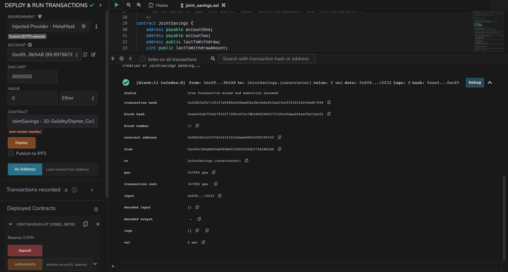
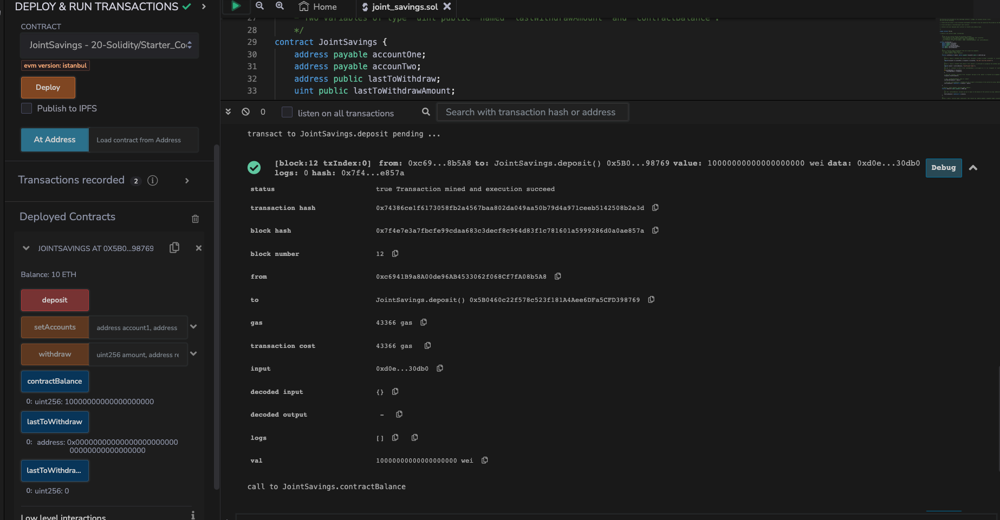
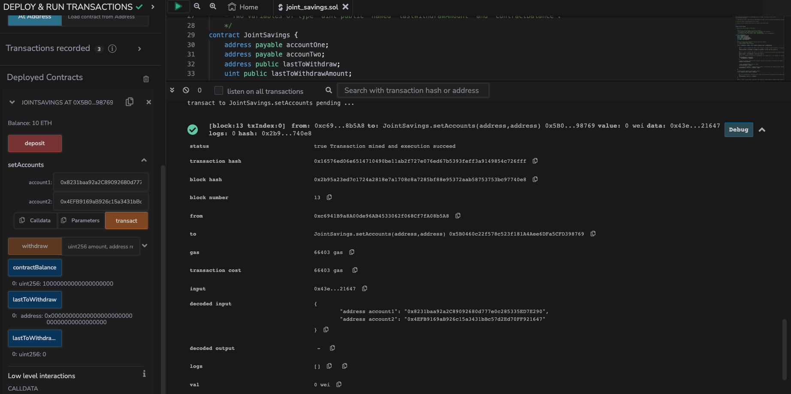
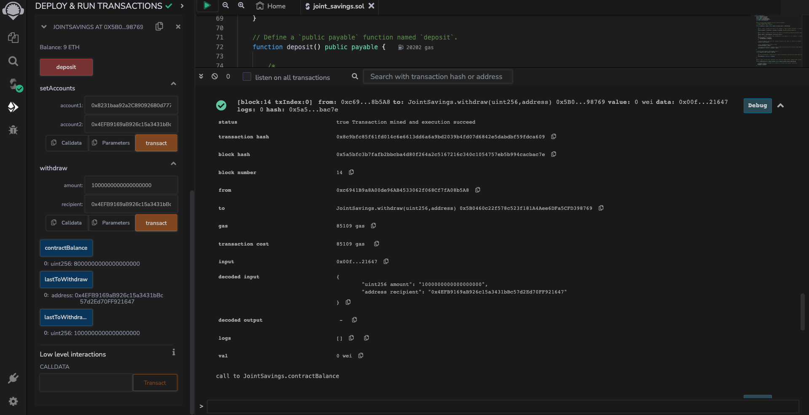
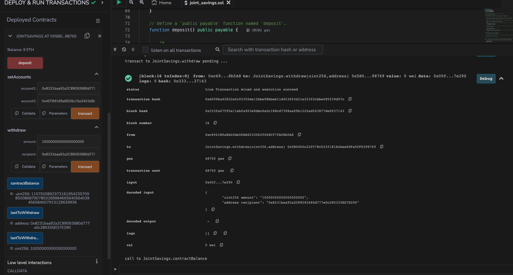
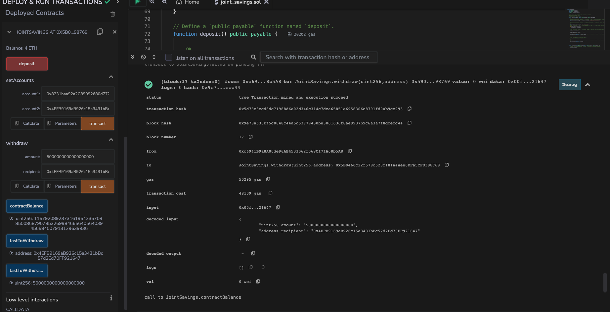

# Ethereum-JointSavings
Develop an Ethereum-compatible blockchain solution for automating joint savings accounts using Solidity. The smart contract allows two users to manage deposits and withdrawals while ensuring account security and maintaining transaction history. It's designed to streamline cross-border financial operations for modern financial institutions

## Joint Savings Contract Results

### 1. Contract Deployment

### 2. Contract Deposit

### 3. Set Accounts Function
Setting accounts: 
- 0x4EFB9169aB926c15a3431bBc57d2Ed70FF921647 
- 0x8231baa92a2C89092680d777e0c285335ED7E290

### 4. Transaction - 1 eth as wei to 0x4EFB9169aB926c15a3431bBc57d2Ed70FF921647

### 5. Transaction - 10 eth as wei to 0x8231baa92a2C89092680d777e0c285335ED7E290

### 6. Transaction - 5 eth to 0x4EFB9169aB926c15a3431bBc57d2Ed70FF921647

